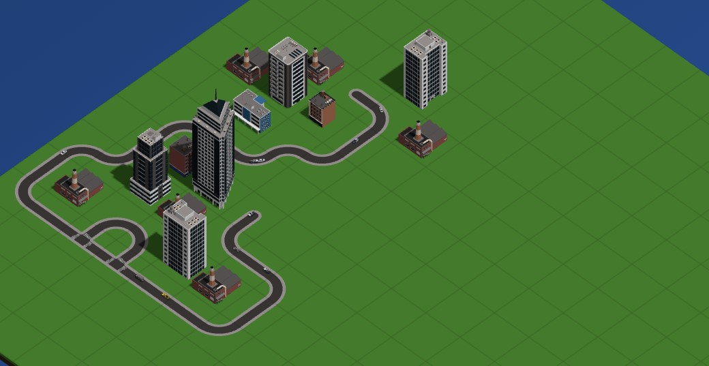

# SimCity Project

This project is a simulator for building your own city. The logic of the game provides for the construction of basic buildings and skyscrapers, power plants, roads and electrical towers.

## How to run project

Install dependencies and [Node JS](https://nodejs.org/en)

```
npm i
```

For run project need run this command

```
npm run dev
```

After that project will open in your localhost

### Tech Stack

- Three JS
- Node JS

## Logic of the game

At the beginning of the simulator launch, a field opens in the left sidebar, you can choose the type of building that can be moved to the field

<center>


</center>

When placing the building on the field and its subsequent reconstruction, it is necessary to additionally move the power plant. This will be required.

<center>


</center>

In turn, for power plants there is a need to lay a path

<center>


</center>

As a result, if all the necessary objects are moved to the field, construction will begin. In addition, the traffic of cars will appear on the roads, which will automatically appear and run along the path of the road. It is also possible to remove an object from the field and pause the game itself

<center>




</center>

Separately, each building has certain information: `the list of workers`, `the level of the building`, `the state of reconstruction`, etc.

<center>


</center>

In close perspective, each object has its own texture

<center>


</center>
